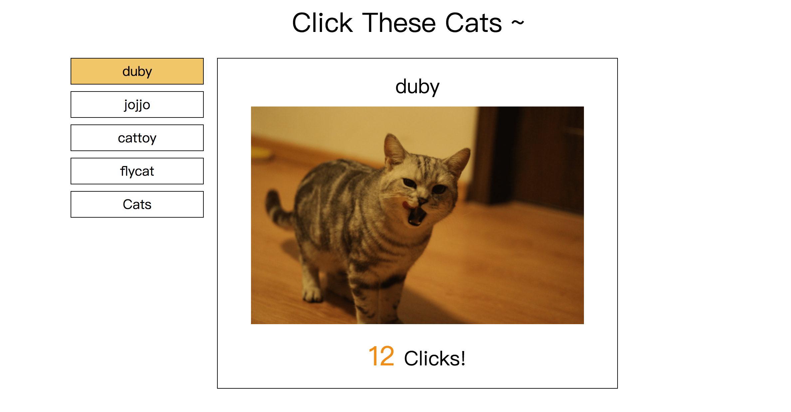
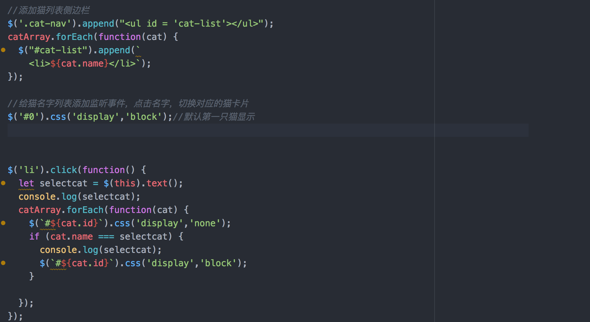

# Cat Clicker

这个项目最终是以 MVC 模式写了一个 猫图像 点击网页。

## Cat Clicker 项目初始要求

视觉

- 该应用程序应该显示猫的图片和点击数。
- 布局的细节无关紧要，因此可以按照你喜欢的方式设置样式。

交互

- 点击猫的图片时，点击数应该增加。

## Version
### v0.1

最基本的实现，点击猫，点击数增加。

### v0.2 增添的需求和实现

视觉

- 该应用程序应该显示两只猫。每只猫都包括
  - 猫的名称
  - 猫的图片
  - 显示点击数的文本
- 布局的细节无关紧要，因此可以按照你喜欢的方式设置样式。

交互

- 点击每张猫的图片时，点击数应该增加。

>不要在 DOM 即文档中硬编码猫的名称，而是存在 JS 变量中，然后更新文档。

- 使用了 flex 进行 CSS 布局
- 彻底改写了`appp.js`，使用 类 来进行 cat 实例的添加
- 可扩展

### V1.0

视觉

- 该应用程序应该显示

  - 一个包含至少 5 只猫的列表（按名称列出）
  - 一块用于显示所选的猫的区域

- 在猫显示区域，应该会显示以下内容

  - 猫的名称
  - 猫的图片
  - 显示点击数的文本

  布局的细节无关紧要，因此可以按照你喜欢的方式设置样式。

交互

- 点击列表中的猫名称时，猫显示区域应该更新以显示所选的猫的数据。
- 猫区域内的点击数应该对每只猫具有唯一性，并且应该在点击猫的图片时增加。

- 在`app.js`中，根据已存在的 cat 实例，在 DOM 中添加 cat list
- 对 cat list 进行事件监听，被点击到的 cat 实例，对应的 cat card 显示（默认隐藏）
- CSS 中使用了两层嵌套 flex 布局

